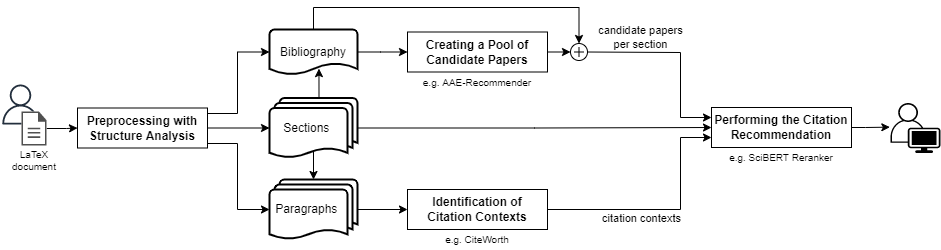

# SCOPE: Section Citation Online PipelinE

Our modular end-to-end global context-aware citation recommendation pipeline SCOPE is depicted above and entails four sub-tasks:
- Preprocessing with our Structure Analysis (see directory `PreprocessingWithStructureAnalysis`)
- Identification of Citation Contexts aka. cite-worthiness detection (see directory `CiteworthinesDetection`)
- Creating a Pool of Candidate Papers utilizing a global citation recommender (see directory `Prefetcher`)
- Performing the Citation Recommendation for each identified citation context (see directory `Reranker`)

## Known issues
- [ ] Some paper differ in the way that citation keys are written in document and the corresponding bib file
- [x] Title extraction fails if title is in format: \title[Something]{Actual Title}